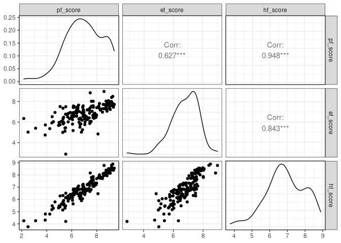

Activity 2 - Day 1
================

## Day 1

### Load The Data

``` r
hfi <- readr::read_csv("https://www.openintro.org/data/csv/hfi.csv")
```

    ## Rows: 1458 Columns: 123
    ## ── Column specification ────────────────────────────────────────────────────────
    ## Delimiter: ","
    ## chr   (3): ISO_code, countries, region
    ## dbl (120): year, pf_rol_procedural, pf_rol_civil, pf_rol_criminal, pf_rol, p...
    ## 
    ## ℹ Use `spec()` to retrieve the full column specification for this data.
    ## ℹ Specify the column types or set `show_col_types = FALSE` to quiet this message.

### Describe pf\_score

``` r
hfi %>% 
  ggplot(aes(x=pf_score)) +
  geom_histogram() + 
  theme_bw()
```

    ## `stat_bin()` using `bins = 30`. Pick better value with `binwidth`.

<!-- --> The
variable `pf_score` has a negative skew, and the distribution appears to
be bimodal. Very few countries have a personal freedom score of less
than 5, however, there seems to be a division between many countries
with a score averaging 7 and others averaging 9.

### Comparing Killed vs Jailed

``` r
hfi %>% 
  ggplot(aes(x=pf_expression_killed, y=pf_expression_jailed)) + 
  geom_point() +
  theme_bw()
```

<!-- --> There
is a positive correlation between `pf_expression_jailed` and
`pf_expression_killed`. However, the this relationship does not appear
to be linear.

### Pairwise Relationships

``` r
hfi %>% 
  select(ends_with("_score")) %>% 
  ggpairs() + 
  theme_bw()
```

<!-- -->

These three variables appear to have a positive linear relationship, and
there appears very few data points with a `pf_score` under 4 and
`ef_score` over 9.

### The Multiple Linear Regression Model

``` r
m_hr_ef <- lm(pf_score ~ hf_score + ef_score, data = hfi)
tidy(m_hr_ef)
```

    ## # A tibble: 3 × 5
    ##   term         estimate std.error statistic p.value
    ##   <chr>           <dbl>     <dbl>     <dbl>   <dbl>
    ## 1 (Intercept)  1.46e-11  1.50e-10  9.78e- 2   0.922
    ## 2 hf_score     2.00e+ 0  3.63e-11  5.52e+10   0    
    ## 3 ef_score    -1.00e+ 0  4.21e-11 -2.38e+10   0

y = 1.464213e-11 + 2`hf_score` - 1`ef_score`

When `hf_score` and `ef_score` are 0, then `pf_score` is 0. For each
unit of `hf_score` then `pf_score` will increase by 2, and for each unit
of `ef_score` then `pf_score` will decrease by 1.

### Challenge: 3D Plots

``` r
# Visual Idea from https://stackoverflow.com/questions/45052188/how-to-plot-3d-scatter-diagram-using-ggplot
#library(plotly)
# plot_ly(x=hfi$pf_score, y=hfi$hf_score, z=hfi$ef_score, type="scatter3d", mode="markers", color = hfi$pf_score) 
```
