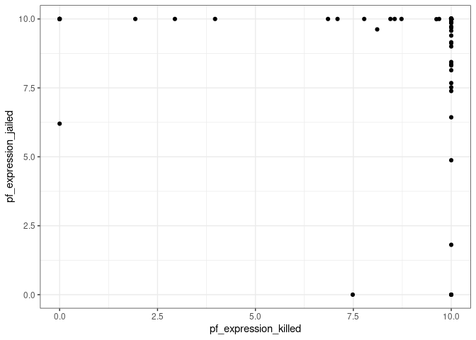

Activity 2 - Day 1
================

## Day 1

### Load The Data

``` r
hfi <- readr::read_csv("https://www.openintro.org/data/csv/hfi.csv")
```

    ## Rows: 1458 Columns: 123
    ## ── Column specification ────────────────────────────────────────────────────────
    ## Delimiter: ","
    ## chr   (3): ISO_code, countries, region
    ## dbl (120): year, pf_rol_procedural, pf_rol_civil, pf_rol_criminal, pf_rol, p...
    ## 
    ## ℹ Use `spec()` to retrieve the full column specification for this data.
    ## ℹ Specify the column types or set `show_col_types = FALSE` to quiet this message.

``` r
hfi_2016 <- filter(hfi, year == 2016)
```

### Describe pf\_score

``` r
hfi_2016 %>% 
  ggplot(aes(x=pf_score)) +
  geom_histogram() + 
  theme_bw()
```

    ## `stat_bin()` using `bins = 30`. Pick better value with `binwidth`.

<!-- --> The
variable `pf_score` has a negative skew, and the distribution appears to
be bimodal. Very few countries have a personal freedom score of less
than 5, however, there seems to be a division between many countries
with a score averaging 7 and others averaging 9.

### Comparing Killed vs Jailed

``` r
hfi_2016 %>% 
  ggplot(aes(x=pf_expression_killed, y=pf_expression_jailed)) + 
  geom_point() +
  theme_bw()
```

<!-- --> There
is a positive correlation between `pf_expression_jailed` and
`pf_expression_killed`. However, the this relationship does not appear
to be linear.

### Pairwise Relationships

``` r
hfi_2016 %>% 
  select(ends_with("_score")) %>% 
  ggpairs() + 
  theme_bw()
```

<!-- -->

These three variables appear to have a positive linear relationship, and
there appears very few data points with a `pf_score` under 4 and
`ef_score` over 9.

### The Multiple Linear Regression Model

``` r
m_hr_ef <- lm(pf_score ~ hf_score + ef_score, data = hfi_2016)
tidy(m_hr_ef)
```

    ## # A tibble: 3 × 5
    ##   term         estimate std.error statistic p.value
    ##   <chr>           <dbl>     <dbl>     <dbl>   <dbl>
    ## 1 (Intercept)  1.44e-10  4.34e-10  3.32e- 1   0.741
    ## 2 hf_score     2.00e+ 0  9.66e-11  2.07e+10   0    
    ## 3 ef_score    -1.00e+ 0  1.18e-10 -8.49e+ 9   0

y = 1.464213e-11 + 2`hf_score` - 1`ef_score`

When `hf_score` and `ef_score` are 0, then `pf_score` is 0. For each
unit of `hf_score` then `pf_score` will increase by 2, and for each unit
of `ef_score` then `pf_score` will decrease by 1.

### Challenge: 3D Plots

``` r
# Visual Idea from https://stackoverflow.com/questions/45052188/how-to-plot-3d-scatter-diagram-using-ggplot
#library(plotly)
# plot_ly(x=hfi_2016$pf_score, y=hfi_2016$hf_score, z=hfi_2016$ef_score, type="scatter3d", mode="markers", color = hfi_2016$pf_score) 
```

## Day 2

### Is One Predictor Useful?

``` r
# review any visual patterns
hfi_2016 %>% 
  select(pf_score, pf_expression_influence, pf_expression_control) %>% 
  ggpairs()
```

<!-- -->

``` r
#fit the mlr model
m_pf <- lm(pf_score ~ pf_expression_influence + pf_expression_control, data = hfi_2016)
tidy(m_pf)
```

    ## # A tibble: 3 × 5
    ##   term                    estimate std.error statistic  p.value
    ##   <chr>                      <dbl>     <dbl>     <dbl>    <dbl>
    ## 1 (Intercept)                4.33     0.147      29.4  3.02e-66
    ## 2 pf_expression_influence    0.155    0.0574      2.70 7.68e- 3
    ## 3 pf_expression_control      0.380    0.0655      5.81 3.29e- 8

In a model of `pf_expression_influence` and `pf_expression_control` both
variables are useful in explaining the y variable. The correlation
values mean that each variable is strongly positively correlated with
`pf_score`.

``` r
summary(m_pf)
```

    ## 
    ## Call:
    ## lm(formula = pf_score ~ pf_expression_influence + pf_expression_control, 
    ##     data = hfi_2016)
    ## 
    ## Residuals:
    ##      Min       1Q   Median       3Q      Max 
    ## -2.74651 -0.46378  0.05426  0.55326  1.62682 
    ## 
    ## Coefficients:
    ##                         Estimate Std. Error t value Pr(>|t|)    
    ## (Intercept)              4.32622    0.14697  29.436  < 2e-16 ***
    ## pf_expression_influence  0.15487    0.05736   2.700  0.00768 ** 
    ## pf_expression_control    0.38036    0.06545   5.811 3.29e-08 ***
    ## ---
    ## Signif. codes:  0 '***' 0.001 '**' 0.01 '*' 0.05 '.' 0.1 ' ' 1
    ## 
    ## Residual standard error: 0.784 on 159 degrees of freedom
    ## Multiple R-squared:  0.7267, Adjusted R-squared:  0.7232 
    ## F-statistic: 211.4 on 2 and 159 DF,  p-value: < 2.2e-16

With an alpha of 0.05, the p-value is less than alpha so we must reject
the null hypothesis. This means that at least one of the variables in
this model is impactful on our predictor, so either
`pf_expression_influence` or `pf_expression_control` is correlated with
`pf_score`.

The standard error of the two variables differ by .008.

### Deciding on Important Variables

The t-values of each variable is correct where the t-values = estimate /
std. error. TODO: 5,6,7

### Model Fit

``` r
glance(m_pf)
```

    ## # A tibble: 1 × 12
    ##   r.squared adj.r.squa…¹ sigma stati…²  p.value    df logLik   AIC   BIC devia…³
    ##       <dbl>        <dbl> <dbl>   <dbl>    <dbl> <dbl>  <dbl> <dbl> <dbl>   <dbl>
    ## 1     0.727        0.723 0.784    211. 1.65e-45     2  -189.  386.  398.    97.7
    ## # … with 2 more variables: df.residual <int>, nobs <int>, and abbreviated
    ## #   variable names ¹​adj.r.squared, ²​statistic, ³​deviance

The R-squared value is .7267 which means that this model improves the
prediction accuracy by 72.67% over using the average of `pf_score`. The
r-squared value of the single linear regression model is .669 so this
multiple linear regression model has an improved accuracy of 10%.

``` r
# obtain fitted values and residuals
m_pf_aug <- augment(m_pf)

# plot fitted values and residuals
ggplot(data = m_pf_aug, aes(x = .fitted, y = .resid)) +
  geom_point() +
  geom_hline(yintercept = 0, linetype = "dashed", color = "red") +
  xlab("Fitted values") +
  ylab("Residuals") + 
  theme_bw()
```

<!-- -->

The residual variation progressively decreases and there are larger
negative deviations.

``` r
ggplot(data = m_pf_aug, aes(x = .resid)) +
  geom_histogram(binwidth = 0.25) +
  xlab("Residuals") + 
  theme_bw()
```

<!-- -->

The residuals histogram appears to be slightly left skewed.

### Prediction

``` r
hfi %>% 
  filter(countries == "United States" & year == 2016) %>% 
  select(pf_score, pf_expression_influence, pf_expression_control)
```

    ## # A tibble: 1 × 3
    ##   pf_score pf_expression_influence pf_expression_control
    ##      <dbl>                   <dbl>                 <dbl>
    ## 1     8.75                       8                     7

``` r
hfi %>% 
  filter(countries == "United States" & year == 2016) %>% 
  predict(m_pf, .)
```

    ##        1 
    ## 8.227657

There error in the United States prediction is 0.52.
